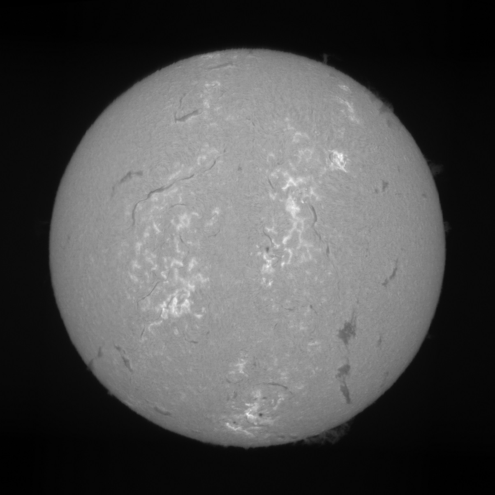

# Astrospec

用来将[扫描成像光谱仪](https://en.wikipedia.org/wiki/Spectroheliograph)拍摄的原始素材，重建为图像。

优势：
- 清晰的API接口
- 基于亚像素插值的波长校正算法
- 附加功能，如颜色映射

## 安装

```bash
pip install astrospec
```

## 使用

### 最终用户（如果你只是想重建图片，不想研究算法和编程）

```bash
# 处理单个文件，在"output/img"子目录中生成png图片文件
ascli -i "<SER文件路径>" [-c color_map_name]

# 处理文件夹，在"output/img"子目录中生成png图片文件
ascli -f "<文件夹路径>" [-c color_map_name]

# 色彩映射 color_map_name (可选):
# - orange-enhanced (默认)
# - enhanced
# - linear (不进行任何映射)

```

### 开发者

#### 例子1

```py
import astrospec as ass
import matplotlib.pyplot as plt

img = ass.raw_file_to_image('input.ser')
plt.imshow(img[0])
plt.show()
```


#### 例子2

```py
import astrospec as ass
import matplotlib.pyplot as plt

img = ass.raw_file_to_image('input.ser', color_map_name='linear')
plt.imshow(img[0], cmap='gray')
plt.show()
```


#### API

- 从ser文件重建图像，返回原始值空间的重建图像，np.array(float64)
```py
def raw_file_to_raw_image(file, shifts = [0], verbose = 0, return_details = False):
    """
    raw_file_to_raw_image 从ser文件重建图像，返回原始值空间的重建图像，np.array(float64)

    :param file: 输入ser文件路径 
    :param shifts: 波长偏移，例如：[-0.5, 0, 0.5]将输出3张偏离谱线中心指定距离的图片，单位为像素
    :param verbose: 0~3，输出调试信息
    :param return_details: 是否返回重建过程中间步骤数据
    :return: 原始值空间的重建图像，np.array(float64)
    """ 
```

- 从ser文件重建图像，返回色彩映射后的重建图像，np.array(uint8)
```py
def raw_file_to_image(file, shifts = [0], color_map_name = 'orange-enhanced', verbose = 0):
    """
    raw_file_to_image 从ser文件重建图像，返回色彩映射后的重建图像，np.array(uint8)

    :param file: 输入ser文件路径 
    :param shifts: 波长偏移，例如：[-0.5, 0, 0.5]将输出3张偏离谱线中心指定距离的图片，单位为像素
    :param color_map_name: 色彩映射，取值范围：orange-enhanced (默认), enhanced, linear (不进行任何映射)
    :param verbose: 0~3，输出调试信息
    :return: 色彩映射后的重建图像，np.array(uint8)
    """ 
```

- 从ser文件重建图像，输出重建图像文件
```py
def raw_file_to_file(file, output_file, shifts = [0], color_map_name = 'orange-enhanced', verbose = 0):
    """
    raw_file_to_file 从ser文件重建图像，输出重建图像文件

    :param file: 输入ser文件路径 
    :param output_file: 输出文件路径。如果shifts有多个值，可通过参数{i:02d}、{shift:02d}指定文件名
    :param shifts: 波长偏移，例如：[-0.5, 0, 0.5]将输出3张偏离谱线中心指定距离的图片，单位为像素
    :param color_map_name: 色彩映射，取值范围：orange-enhanced (默认), enhanced, linear (不进行任何映射)
    :param verbose: 0~3，输出调试信息
    :return: None
    """ 
```

## 参考
1. [SolEx](http://www.astrosurf.com/solex/sol-ex-presentation-en.html) - 法国友人Valerie Desnoux的开源光谱仪，提供了3D打印文件，另外还有非常详细的介绍，值得细读
2. [DIY迷你太阳光谱仪](https://www.bilibili.com/video/BV1um421j7co) by 阴天wnova酱 - up进行了包括小型化在内的改进，提供了3D打印件STL文件和所有物料表的淘宝链接
3. [Solex_ser_recon](https://github.com/Vdesnoux/Solex_ser_recon) - 法国友人Valerie Desnoux的开源重建软件
4. [SHG](https://github.com/thelondonsmiths/Solex_ser_recon_EN)
5. [又能看光谱又能拍摄太阳的太阳光谱仪](https://www.bilibili.com/video/BV1fw411W7HJ) by 摄日者天文
6. [太阳光谱扫描成像](https://lcsky.org/3.0/2024/05/19/spectroheliograph-1/) by 梁晨 - 拍摄注意事项

## License

本项目基于MIT许可证发布，详见[LICENSE](LICENSE)。

包含本项目代码的二进制发布，请保留指向本项目的链接、作者信息和License，并对最终用户可见。
