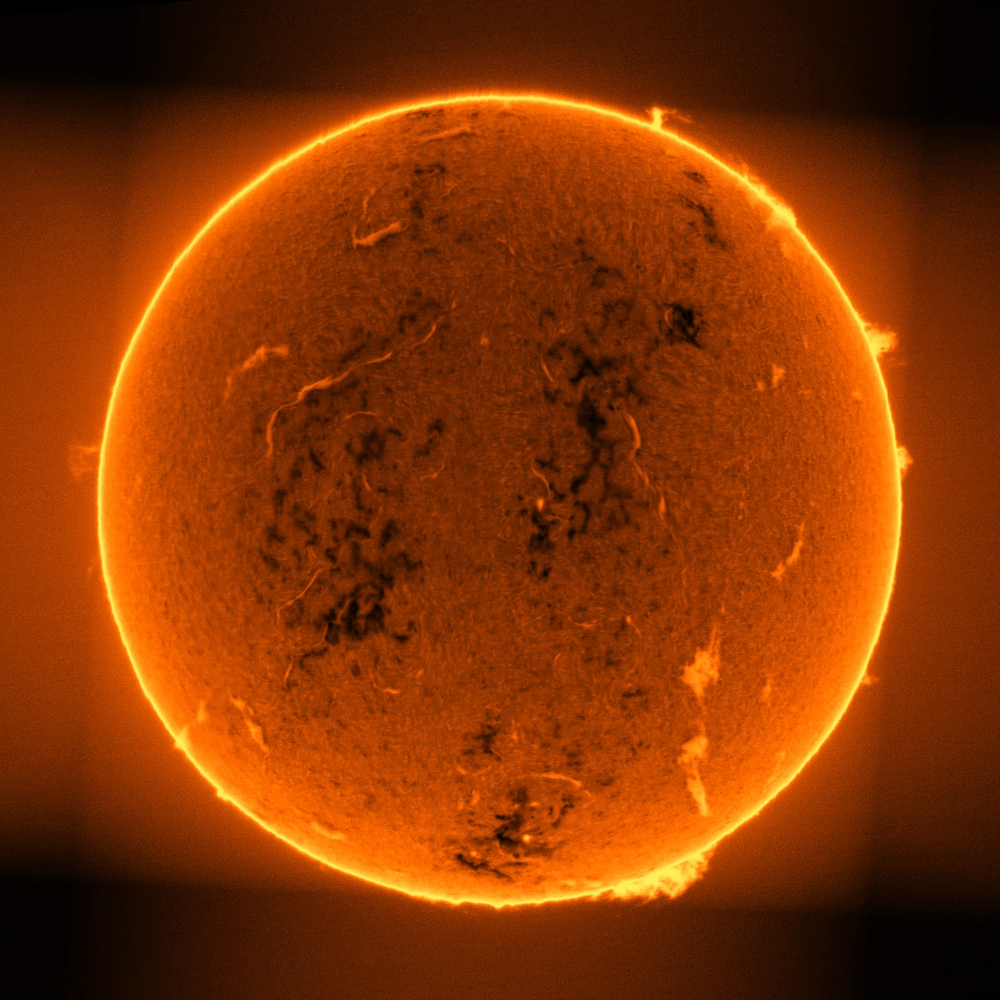
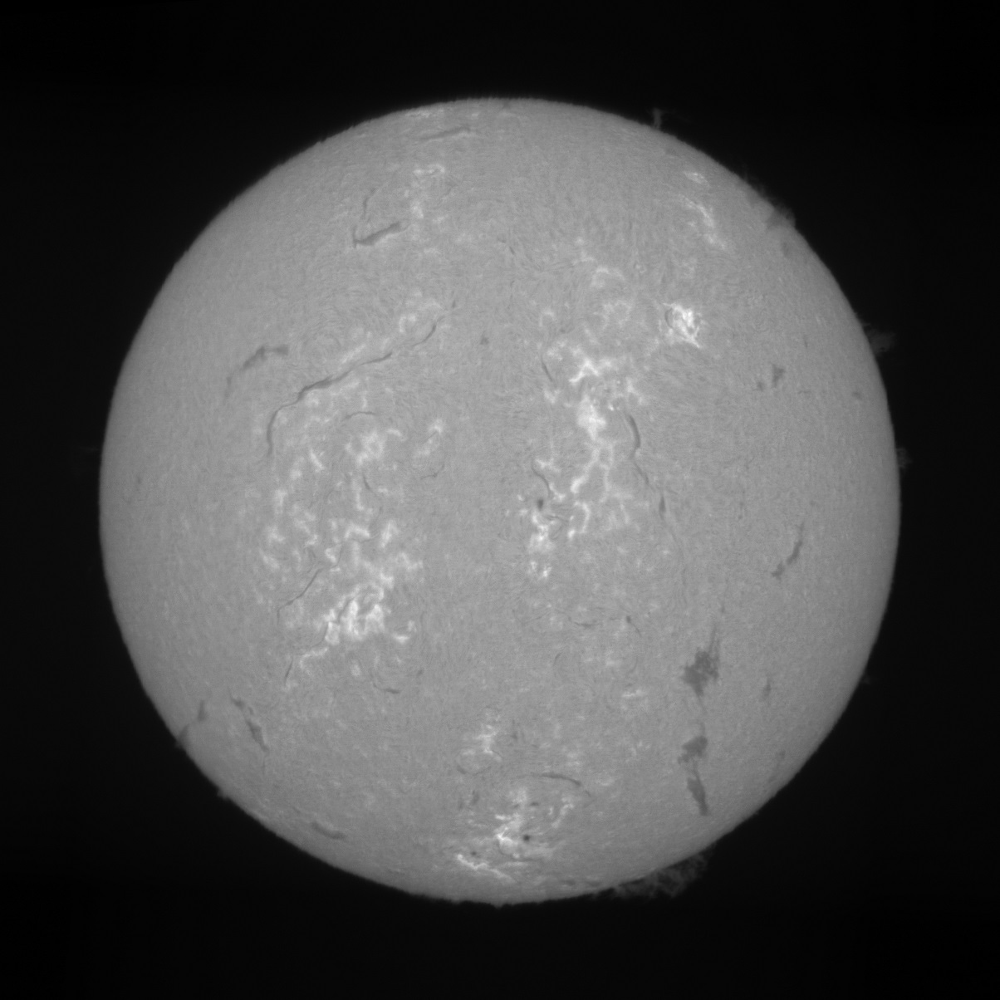

# Astrospec

[[English](README.md)] [[中文](README-CN.md)]

This project is used to reconstruct image from raw video captured by the [spectroheliograph](https://en.wikipedia.org/wiki/Spectroheliograph)

**Highlights**
- Clear API interface
- Algorithm with sub-pixel interpolation for wavelength correction 
- Additional features such as color mapping

## Installation

```bash
pip install astrospec
```

## Getting Started

### For end users

```bash
# single file input, generate png files at the sub-folder named "output/img"
ascli -i "<SER file>" [-c color_map_name]

# process all .ser files in the folder, generate png files at the sub-folder named "output/img"
ascli -f "<folder>" [-c color_map_name]

# color_map_name（optional）:
# - orange-enhanced (default)
# - enhanced
# - linear

```

### For developers

#### example 1

```py
import astrospec as ass
import matplotlib.pyplot as plt

img = ass.raw_file_to_image('input.ser')
plt.imshow(img[0])
plt.show()
```


#### example 2

```py
import astrospec as ass
import matplotlib.pyplot as plt

img = ass.raw_file_to_image('input.ser', color_map_name='linear')
plt.imshow(img[0], cmap='gray')
plt.show()
```


#### API

- Reconstruct image from the ser file, return the reconstructed image in the original value space, np.array(float64)
```py
def raw_file_to_raw_image(file, shifts = [0], verbose = 0, return_details = False):
    """
    raw_file_to_raw_image reconstruct image from raw video (ser file), return the reconstructed image, np.array(float64)

    :param file: input file path
    :param shifts: the wavelength offsets in pixels, e.g. [-0.5, 0, 0.5] returns 3 images in corresponding wavelengths
    :param verbose: 0~3，log information level
    :param return_details: whether to return data from intermediate steps
    :return: reconstructed image, np.array(float64)
    """ 
```

- Reconstruct image from the ser file, return the reconstructed image after color mapping, np.array(uint8)
```py
def raw_file_to_image(file, shifts = [0], color_map_name = 'orange-enhanced', verbose = 0):
    """
    raw_file_to_image reconstruct image from raw video (ser file), return the reconstructed, normalized, color mapped image, np.array(uint8)

    :param file: input file path
    :param shifts: the wavelength offsets in pixels, e.g. [-0.5, 0, 0.5] returns 3 images in corresponding wavelengths
    :param color_map_name: color map, values: orange-enhanced (default), enhanced, linear
    :param verbose: 0~3，log information level
    :return: reconstructed, normalized, color mapped image, np.array(uint8)
    """ 
```

- Reconstruct image from the ser file, write reconstructed image to file(s)
```py
def raw_file_to_file(file, output_file, shifts = [0], color_map_name = 'orange-enhanced', verbose = 0):
    """
    raw_file_to_file reconstruct image from raw video (ser file), write reconstructed, normalized, color mapped image to file(s)

    :param file: input file path
    :param output_file: output file path
    :param shifts: the wavelength offsets in pixels, e.g. [-0.5, 0, 0.5] returns 3 images in corresponding wavelengths
    :param color_map_name: color map, values: orange-enhanced (default), enhanced, linear
    :param verbose: 0~3，log information level
    :return: None
    """ 
```

## Reference
1. [SolEx](http://www.astrosurf.com/solex/sol-ex-presentation-en.html) - The design of a DIY spectroheliograph by Valerie Desnoux, with very detailed introduction, which is worth reading carefully.
2. [DIY迷你太阳光谱仪](https://www.bilibili.com/video/BV1um421j7co) by 阴天wnova酱 - The design of another DIY mini-spectroheliograph
3. [Solex_ser_recon](https://github.com/Vdesnoux/Solex_ser_recon) - An open-source reconstruct software made by Valerie Desnoux
4. [SHG](https://github.com/thelondonsmiths/Solex_ser_recon_EN) - Another open-source reconstruct software
5. [又能看光谱又能拍摄太阳的太阳光谱仪](https://www.bilibili.com/video/BV1fw411W7HJ) by 摄日者天文
6. [太阳光谱扫描成像](https://lcsky.org/3.0/2024/05/19/spectroheliograph-1/) by Harold Liang - My DIY and observation records

## License

Astrospec has a MIT-style license, as found in the [LICENSE](LICENSE) file.
